# Jarkom_Modul2_Lapres_B09
## Soal 1 - 7
#### UML MALANG
/etc/bind/named.conf.local  
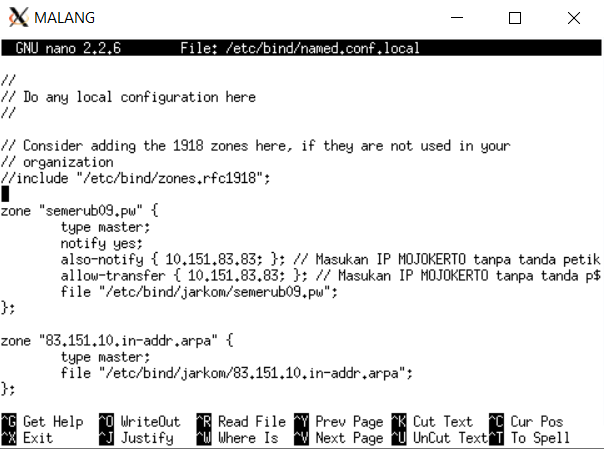

/etc/bind/jarkom/semerub09.pw  
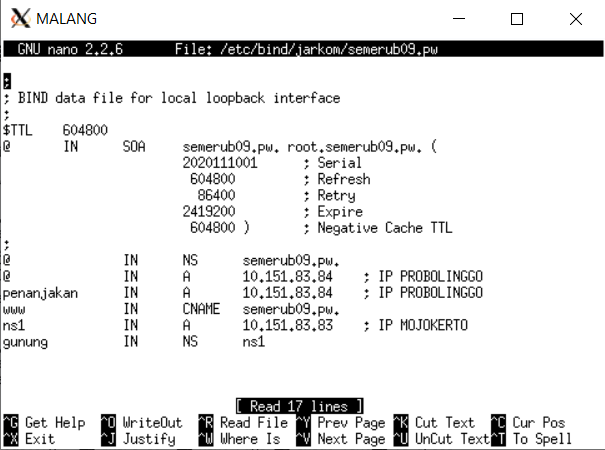

/etc/bind/jarkom/83.151.10.in-addr.arpa  
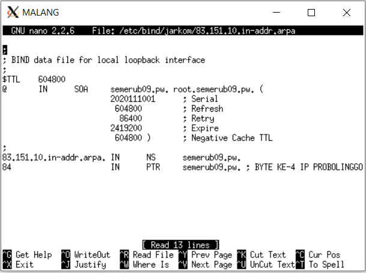

#### UML MOJOKERTO
/etc/bind/named.conf.local  
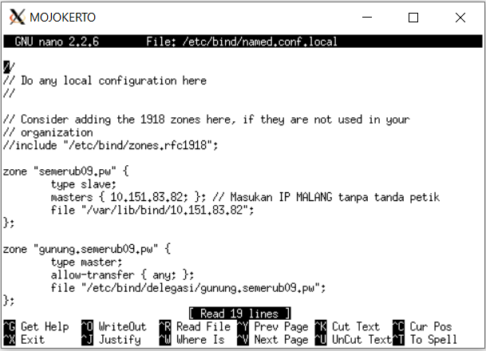

/etc/bind/delegasi/gunung.semerub09.pw  
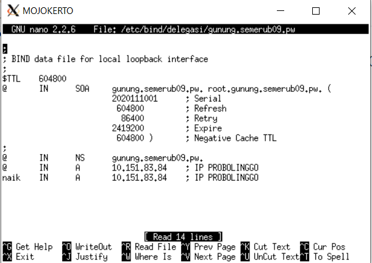

#### Soal 1
Domain semerub09.pw yang mengarah ke IP PROBOLINGGO  
Penjelasan :
- Tambahkan zone semerub09.pw pada file `/etc/bind/named.conf.local` UML MALANG
- Buat file `/etc/bind/jarkom/semerub09.pw` UML MALANG
- Masukkan record A dengan host `@` yang diarahkan ke IP PROBOLINGGO
#### Soal 2
Alias 'www.semerub09.pw'  
Penjelasan :
- Pada file `/etc/bind/jarkom/semerub09.pw` UML MALANG tambahkan record CNAME dengan value www mengarah ke domain semerub09.pw
#### Soal 3
Subdomain penanjakan.semerub09.pw  
Penjelasan :
- Pada file `/etc/bind/jarkom/semerub09.pw` UML MALANG tambahkan record A dengan host `penanjakan` mengarah ke IP PROBOLINGGO
#### Soal 4
Reverse domain untuk semerub09.pw  
Penjelasan :
- Tambahkan zone 83.151.10.in-addr.arpa pada file `/etc/bind/named.conf.local` UML MALANG
- Buat file `/etc/bind/jarkom/83.151.10.in-addr.arpa` UML MALANG
- Masukkan record PTR dengan last-ip-digit 84 (byte ke 4 IP PROBOLINGGO) dan mengarah ke domain semerub09.pw
#### Soal 5
DNS Server Slave pada MOJOKERTO  
Penjelasan :
- Pada file `/etc/bind/named.conf.local` UML MALANG zone semerub09.pw, ditambahkan also-notify dan allow-transfer yang diisikan IP MOJOKERTO
- Tambahkan zone semerub09.pw pada file `/etc/bind/named.conf.local` UML MOJOKERTO dan diberi tipe zone slave
#### Soal 6
Subdomain gunung.semerub09.pw didelegasikan pada MOJOKERTO  
Penjelasan :
- Pada file `/etc/bind/jarkom/semerub09.pw` UML MALANG tambahkan record A dengan host `ns1` mengarah ke IP MOJOKERTO
- Tambahkan juga record NS dengan host `gunung` mengarah ke ns1
- Pada file `/etc/bind/named.conf.local` UML MOJOKERTO tambahkan zone gunung.semerub09.pw
- Buat file `/etc/bind/delegasi/gunung.semerub09.pw` UML MOJOKERTO
- Masukkan record A dengan host `@` yang diarahkan ke IP PROBOLINGGO
#### Soal 7
Subdomain naik.gunung.semerub09.pw mengarah ke IP MOJOKERTO  
Penjelasan :
- Tambahkan record A dengan host `naik` mengarah ke IP PROBOLINGGO

## Soal 8
Domain http://semeruyyy.pw memiliki DocumentRoot pada /var/www/semeruyyy.pw  
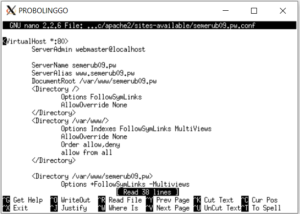  
Penjelasan :
- Buat file `semerub09.pw.conf` pada directory sites-available
- Mengisikan ServerName, ServerAlias, dan DocumentRoot sesuai permintaan

## Soal 9
Rewrite semerub09.pw/index.php/home menjadi semerub09.pw/home  
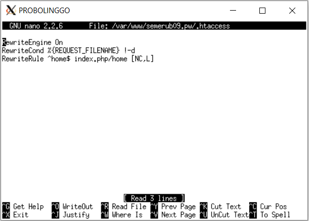  
Penjelasan :
- Buat file `.htaccess` pada directory DocumentRoot semerub09.pw
- Ganti rewrite rule agar mengganti tulisan `home` dengan `index.php/home`

## Soal 10
Domain http://penanjakan.semeruyyy.pw memiliki DocumentRoot pada /var/www/penanjakan.semeruyyy.pw  
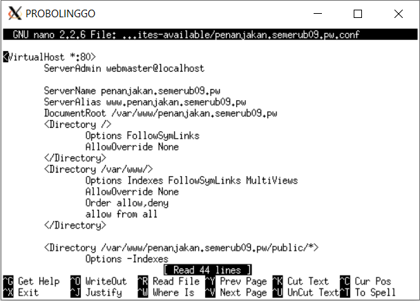  
Penjelasan :
- Buat file `penanjakan.semerub09.pw.conf` pada directory sites-available
- Mengisikan ServerName, ServerAlias, dan DocumentRoot sesuai permintaan

## Soal 11
Directory listing folder /public  
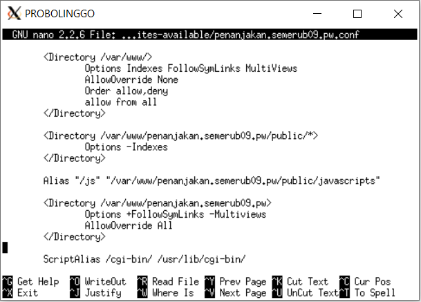  
Penjelasan :
- Tambahkan pengaturan directory untuk seluruh folder dalam /public menjadi `Options -Indexes`

## Soal 12
Mengganti error default apache  
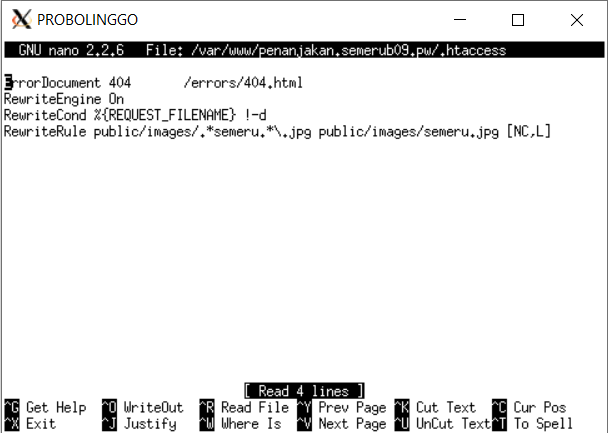  
Penjelasan :
- Buat file `.htaccess` pada directory DocumentRoot penanjakan.semerub09.pw
- Arahkan ErrorDocument 404 ke `/errors/404.html`

## Soal 13
Alias http://penanjakan.semeruyyy.pw/js  
  
Penjelasan :
- Tambahkan alias `/js` untuk `/var/www/penanjakan.semerub09.pw/public/javascripts`

## Soal 14
Domain http://naik.gunung.semeruyyy.pw memiliki DocumentRoot pada /var/www/naik.gunung.semeruyyy.pw diakses menggunakan port 8888  
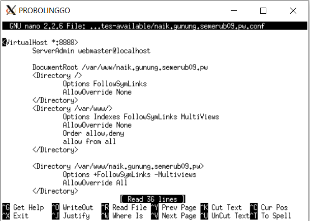  
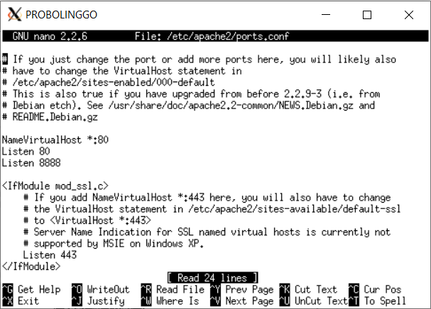  
Penjelasan :
- Buat file `penanjakan.semerub09.pw.conf` pada directory sites-available
- Mengganti port virtual host menjadi 8888
- Tambahkan `Listen 8888` pada file `ports.conf`

## Soal 15
Autentifikasi password web http://naik.gunung.semeruyyy.pw  
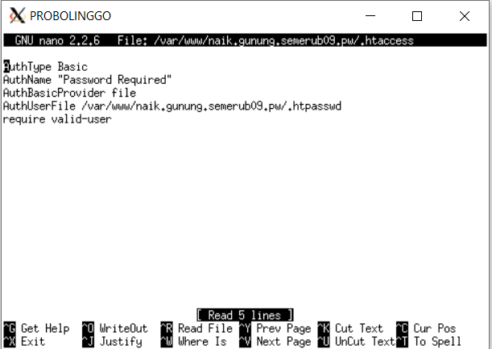  
Penjelasan :
- Buat file `.htaccess` pada directory DocumentRoot naik.gunung.semerub09.pw
- Arahkan file autentifikasi ke .htpasswd
- Buat file `.htpasswd` dengan command `htpasswd -bc (lokasi buat file) (user) (password)`

## Soal 16
Ganti halaman default apache ke halaman semerub09.pw  
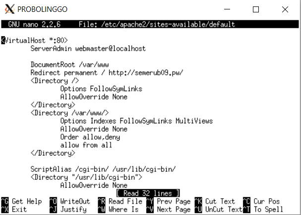  
Penjelasan :
- Tambahkan `Redirect permanent` yang mengarah ke web semerub09.pw

## Soal 17
Request gambar yang memiliki substring "semeru" akan diarahkan menuju semeru.jpg  
  
Penjelasan :
- Ganti rewrite rule agar mengganti tulisan mengantung substring "semeru" dengan `semeru.jpg`
- Penulisan rewrite : `.*semeru.*\.jpg`
